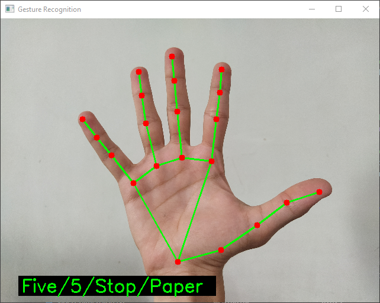

# Hand Gesture Recognition

---

This project was created with [MediaPipe](https://mediapipe.dev) and [OpenCV](https://docs.opencv.org/4.5.2/). This project was a part of a college project.

The program can dientify following gestures:

- Zero/Fist/Stone
- One
- Two
- Three
- Four
- Five/Stop/Paper
- Middle finger
- Thumbs Up/Okay
- Rock On
- Yolo

Image gets blur when a middle finger is found

Credits to [this video](https://www.youtube.com/watch?v=NZde8Xt78Iw)
